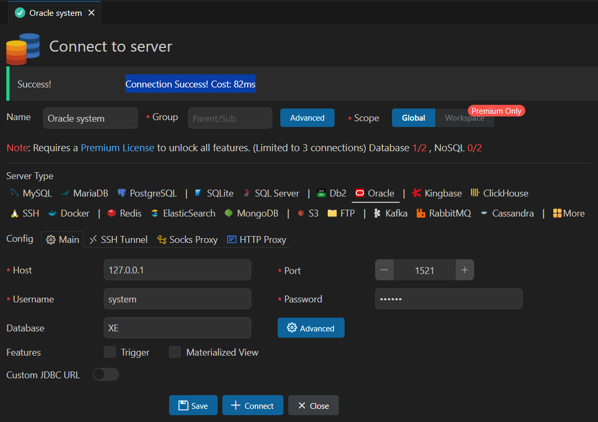

# java-database-2025
java개발자 과정 database 리포지토리

## 1일차
- Github Desktop 설치
    - https://desktop.github.com/download/ 다운로드
    - 기본 깃허브 계정으로 로그인
    - git 명령어 없이 사용가능
- Database(DB) 개요
    - 데이터를 저장하는 장소, 서비스를 하는 서버
    - 데이터베이스를 관리하는 프로그램 DBMS
    - 가장 유명한 것 Oracle
    - 사용자는 SQL로 요청, DB서버는 처리결과를 테이블로 리턴
    - SQL 배우는 것!
- Oracle 설치 (Docker)
    1. powershell 오픈 # docker pull doctorkirk/oracle-19c
       ```
       > docker pull oracleinanutshell/oracle-xe-11g
       ```
    2. 다운로드 이미지 확인
        ```shell
        ps c:\User\Admin> docker image ls
        REPOSITORY                 TAG       IMAGE ID       CREATED         SIZE
        ```
    3. 도커 컨테이너 실행
        ```shell
        > docker run --name oracle11g -d -p 1521:1521 --restart=always oracleinanutshell/oracle-xe-11g
        ```
        - 1521 - 오라클 기본포트
        - 아이디 system / oracle 

    4. 도커 실행확인
        - Docker Desktop > Containers 확인
    5. powershell 오픈
        ```shell
        > docker exec -it oracle19c bash
        [oracle@7ec8e1146679 ~]$ sqlplus / as sysdba
        SQL > 
        ```
    6. DBeaver 접속
        - DBeaver 툴 설치
            - https://dbeaver.io/download/
        - connection > select your DB > oracle 선택
        - 
        

- DML, DDL, DCL
    - 언어의 특징을 가지고 있음
        - 프로그래밍언어와의 차이 : 어떻게(HOW)
        - SQL : 무엇(WHAT)
    - SQL의 구성요소 3가지
    - DDL(Data control Language) - 데이터베이스 생성, 테이블 생성, 객체 생성, 수정, 삭제
        - CREATE, ALTER, DROP ...
    - DCL(Data control Language) - 사용자 권한 부여, 해제, 트랜잭션 시작, 종료
        - GRANT, REVOKE, BEGIN TRANS, COMMIT, ROLLBACK
    - DML(Data manupulation Language) - 데이터 조작언어, 데이터 삽입, 조회, 수정, 삭제
        - `INSERT`, `SELECT`, `UPDATE`,`DELETE`

- SELECT 기본
    - 데이터 조회 시 사용되는 기본명령어
        ```sql
        --(주석) 한줄 기본주석
        /* 여러줄 주석가능 */
        SELECT [ALL|DISTINCT] [*|컬럼명(리스트들)]
            FROM 테이블명(들)
        [WHERE 검색조건(들)]
        [GROUP BY 속성명(들)]
        [HAVING 집계함수조건(들)]
        [ORDER BY 정렬속성(들) ASC|DESC]
        [WITH ROLLUP]
        ```
    - 기본 쿼리 학습 : [SQL]()
        1. 기본 SELECT
        2. WHERE 조건절
        3. NULL(!)
        4. ORDER BY 정렬
        5. 집합
- 함수(내장함수)
    - 문자함수 : [SQL]C:\source\java-database-2025\DAY01\sql002_함수.sql

## 2일차
- 함수 계속
    - 문자함수 부터: "C:\source\java-database-2025\DAY02\SQL_함수 계속.sql"
    - 숫자함수
    - 날짜함수
    - 형변환함수
- 복수행 함수 :
    - 집계함수:
    - GROUP BY :
    - HAVING :
    - ROLLUP :
    - RANK, DENSE_RANK, ROW_NUMBER :

- 데이터베이스 타입형
    - **CHAR(n)** - 고정형 문자열, 최대 2000바이트
        - **CHAR(20)** 으로 'Hello World' 입력하면 , 'Hello World         ' 로 저장
    - **VARCHAR(n)** - 가변형 문자열, 최대 4000바이트
        - 'Hello World'
        - **VARCHAR(20)** 으로 'Hello World' 입력하면 , 'Hello World' 로 저장
    - **NUMBER(P,S)** - 숫자값, P 전체자리수, S소수점길이. 최대 22byte
    - INTEGER - 모든 데이터의 기준. 4BYTE, 정수를 담는 데이터형
    - float(p) - 실수형 타입, 최대 22byte
    - **DATE** - 날짜타입
    - **LONG(n)** - 가변길이 문자열, 최대 2G바이트
    - LONG RAW(n) -원시이진 데이터, 최대 2G바이트
    - CLOB -대용량 텍스트 데이터타입, 최대 4G
    - BLOB -대용량 바이너리 데이터타입, 최대 4G
    - BFILE -외부파일에 저장된 데이터, 4G

## 3일차
- JOIN
    - 카티션곱
    - 내부조인, 외부조인
- DDL
    - CREATE, ALTER, DROP

## 4일차
- vs Code DB플러그인
    - 확장 > Database 검색 > Database Client(weijan Chen) > 확장중 Database 선택
    
- DML
    - INSERT - 테이블에 새로운 데이터를 삽입
             - 한 건씩 삽입 
             ```sql
             INSERT INTO 테이블명 [(칼럼리스트)]
             VALUES (값리스트);   
             ```
    - UPDATE - 테이블 변경, WHERE 조건없이 실행하면 모든 데이터가 수정됨(주의)
        ```sql
        UPDATE 테이블명 SET
            컬럼명 = 변경할 값,
            [컬럼명 = 변경할 값]  ---반복
        [WHERE 조건]
        ```
    - DELETE - 데이터삭제, WHERE 조건없이 실행하면 테이블 모든 데이터가 삭제됨(주의)
        ```sql
        DELETE FROM 테이블명
        [WHERE 조건];
        ```
- 트랜잭션
    - 논리적인 처리단위
    - 은행에서 돈 찾을때 아주 많은 테이블 접근해서 일을 처리
        - 적어도 일곱여덟개 이상 테이블 접근해서 조회하고 업데이트 수행
        - 제대로 일처리안되면 다시 원상복귀
        - DB 설정 AUTO COMMIT 해제 권장
        - ROLLBACK 트랜잭션 종료가 아님 COMMIT만 종료
        ```sql
        SET TRANSACTION READ WRITE; -- 트랜젝션 시작(옵션)
        COMMIT;  --트랜잭션 확정
        ROLLBACK; --원상복귀
        ```
- 제약조건
     - 잘못된 데이터가 들어가지 않도록 막는 기법
         - PK - 기본키, UNIQUE NOT NULL. 중복되지않고 없어도 안됨
         - FK - 외래키, 다른테이블 PK에 없는 값을 가져다 쓸 수 없음
         - NOT NULL - 값이 빠지면 안됨
         - UNIQUE - 들어간 데이터가 중복되면 안됨
         - CHECK - 기준에 부합하지 않는 데이터는 입력되면 안됨
         ```sql
         CREATE TABLE 테이블명 (
              컬럼 생성시 제약조건 추가
         );

         ALTER TABLE 테이블명 ADD CONSTRAINT 제약조건

- INDEX :[INDEX쿼리] DAY004 , [인덱스용테이블생성] 벌크004
    - 책의 찾아보기와 동일한 기능
    - 검색을 매우 빨리 할 수 있도록 해줌
    - B(alance) Tree를 사용해서 검색횟수를 log(n)건 반이하로 줄임
    - 인덱스 종류
        - 클러스터드 (Clustered) 인덱스 (테이블 당 1개)
            - PK에 자동으로 생성되는 인덱스(빠름)
            - PK가 없으면 처음으로 설정되는 UNIQUE 제약조건의 컬럼에 생성
        - 보조 인덱스(NON-Clustered) 인덱스(여러개)
            - 사용자가 추가하는 인덱스
            - 클러스터드 보다 조금 느림
    - 유의점
        - PK에 자동 인덱스 후 컬럼에 UNIQUE를 걸어도 인덱스가 생성안됨. 수동으로 생성 필요
        - WHERE절에서 검색하는 컬럼은 인덱스를 걸어주는 것이 성능향상에 도움
        - 인덱스는 한 테이블 당 4개이상 걸면 성능 저하
        - NULL값, 중복값이 많은 컬럼에 인덱스는 성능 저하
        - INSERT, UPDATE, DELETE가 많이 발생하는 테이블에 인덱스를 걸면 성능 저하

        ```sql
        CREATE INDEX 인덱스명 ON 테이블명(인덱스컬럼명)
        ```

## 5일차
- VIEW
- 서브쿼리
- 시퀀스
...


